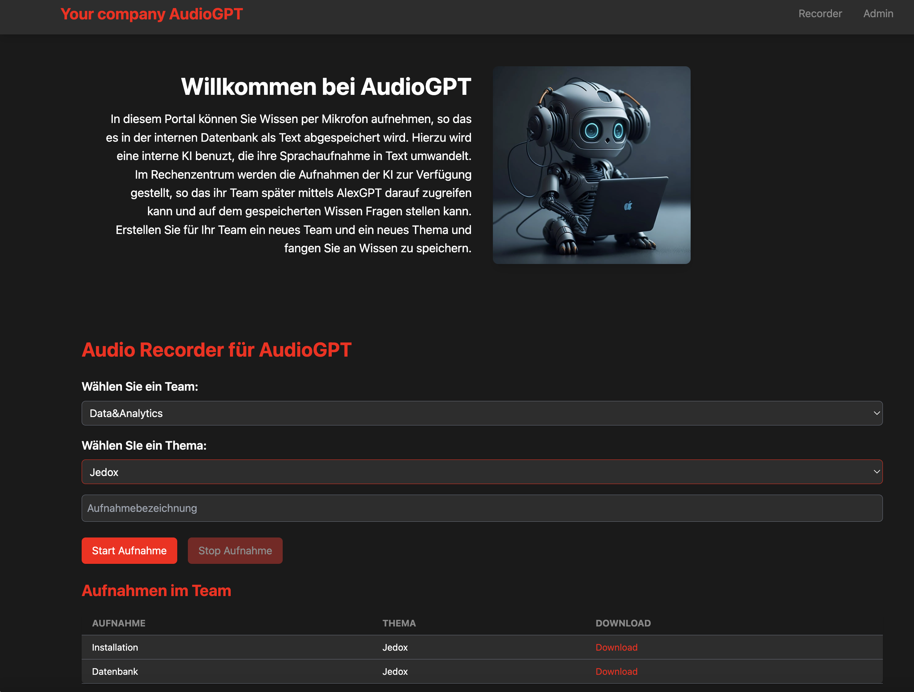

# Audio GPT


# Idea
* Recording voice with Vue.js app and save the audio file to the server.
* Transcribe the audio file with Whisper
* Provide a chatbot using the transcribed text with RAG

# Tech Stack
- Postgres to store Metadata
- Vue.js app to record the audio and manage the teams and topics
- Express backend to save the audio files and manage the teams and topics
- Whisper for transcribing the recorded audio
- Ollama for deploying LLama
- Streamlit for the UI
- Langchain and Chroma for RAG

# Setup
## Docker Postgres
```bash
docker pull postgres
docker run --name postgres -e POSTGRES_PASSWORD=postgres -d -p 5432:5432 -v ./data:/var/lib/postgresql/data postgres
```
## Web
- Install Node.js
- Install Streamlit

## AI frameworks
- Install Whisper (https://pypi.org/project/openai-whisper/)
- Install Ollama
- Chroma

# Usage

## Frontend Dev
```bash
cd web/audio-recorder-app
npm install
npm run serve
```

## Frontend Prod
```bash
cd web/audio-recorder-app
npm install
npm run build
npm install -g serve
serve -l portnr -s dist
```

## Backend
```bash
cd backend
npm install
node server.js
```

## Chroma Vector Database
```bash
pip install chromadb
chroma run --host localhost --port 8000 --path ./rag_audio_vector_database

or

docker run -d --rm --name chromadb -v ./chroma:/chroma/chroma -e IS_PERSISTENT=TRUE -e ANONYMIZED_TELEMETRY=TRUE chromadb/chroma:latest
```

## RAG Client using AudioGPT

- Implemented with streamlit
- Use Chroma for RAG

## Audio recording frontend

- Implemented with Vue.js
- Backend with Express
- Postgres for metadata

## Backup recommendations
- Backup the Postgres database volume
- Backup the Chroma database volume
- Backup of the uploaded audio files

## Links
- https://cookbook.chromadb.dev/running/running-chroma/#chroma-cli